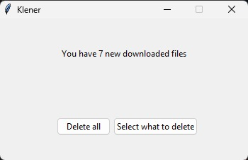
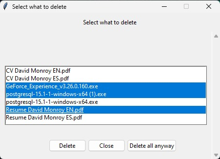
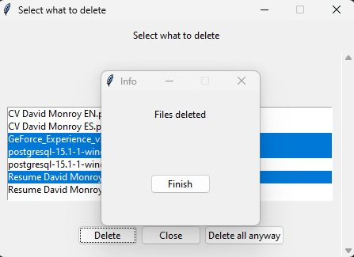

# Klener

Klener is an executable file which only purpose in life is to clean all garbage files that we forget to delete after downloading and that can take space in our `Downloads` folder and turn it into a mess.

## Getting Started

These instructions will give you a copy of the project up and running on
your local machine for development and testing purposes.


## Prerequisites
 
- `pip` version `>=22.3.1`
- `Python` version `>=3.10`
- `Windows` version `>=10`

## Installation steps

**Note**: Be sure to create a new folder where you wish to have a copy of **Klener**.

First you have to clone this Git repository on your local machine within the folder you chose to install **Klener** with the following command:

`git clone https://github.com/davidzaaan/klener.git`

In this case the cloning example will be using the HTTPS method but you can use the method of your preference.


This should leave you a folder with the following structure:
```
klener/
    utils/
    klener.py
    .gitignore
    requirements.txt
    README.md
```

**Note:** It is recommended to create a Python virtual environment within the cloned repository folder in order to install all the required packages for this project. If you don't know what a virtual environment is and how to activate one. Up next I leave you a YouTube video that can help.

[Python Tutorial: VENV (Windows) - How to Use Virtual Environments with the Built-In venv Module](https://www.youtube.com/watch?v=APOPm01BVrk) - *by Corey Schafer*

---

**Note:** For this tutorial purposes we will call the new environment `env` but you can name it as you will.

To activate your virtual environment run the following command on your preferred terminal:

```
username MINGW64 ~/OneDrive/Desktop/klener (main)
$ virtualenv env
```

Once you have installed and activated successfully your environment you should have a folder structure like the following.

```
klener/
    env/
    utils/
    klener.py
    .gitignore
    README.md
    requirements.txt
```

And your terminal now should look like this with the activated environment

```
(env)
username MINGW64 ~/OneDrive/Desktop/klener (main)
$ 
```

Now, install the packages with the command

`pip install -r requirements.txt`

**Note**: `pip` installing commands can vary according to your Windows and Python version. Be sure to have your `pip` and Python version up to date.


## Creating the Klener file

The next step is to create our executable file to run **Klener**.

Within the same folder you made the installation open a new terminal of your preference. In this case I'll be using **Git Bash** and run the following command

```
(env)
username MINGW64 ~/OneDrive/Desktop/klener (main)
$ pyinstaller --noconsole --onefile --name Klener klener.py
```

The previous command should leave us a folder structure like the following

```
klener/
    build/
    dist/
    env/
    utils/
    .gitignore
    klener.py
    Klener.spec
    README.md
    requirements.txt
```

But our executable file is in the `dist` folder. Feel free to delete the `build` folder and the `Klener.spec` file.

Once you have executed the `Klener.exe` file within the `dist` folder. You are ready to go cleaning your Downloads folder!

## Tutorial

Now that we have **Klener** all set, it is time to dump the trash.

The first time you open **Klener** you will be presented with an interface like this one:



Assuming that you have 7 files that you forgot to delete, let's not clear them all this time, let's select just a few files to delete for this tutorial purposes.

Clicking on the `Select what to delete` button will open a new window where you can choose what files you want to delete and which ones you want to keep.



Now click on the `Delete` button and a finishing window will pop up



**Note**: In this tutorial we showed how to delete only selected files but you will always be able to clean your entire `Downloads` folder being presented with the `Delete all` and `Delete all anyways` buttons. These buttons will delete all the existing files in your `Downloads` directory.

That's it. You are ready to keep the trash on its place.  

## Authors

  - **David Monroy** - *Project creator and developer* -
    [davidzaaan](https://github.com/davidzaaan)